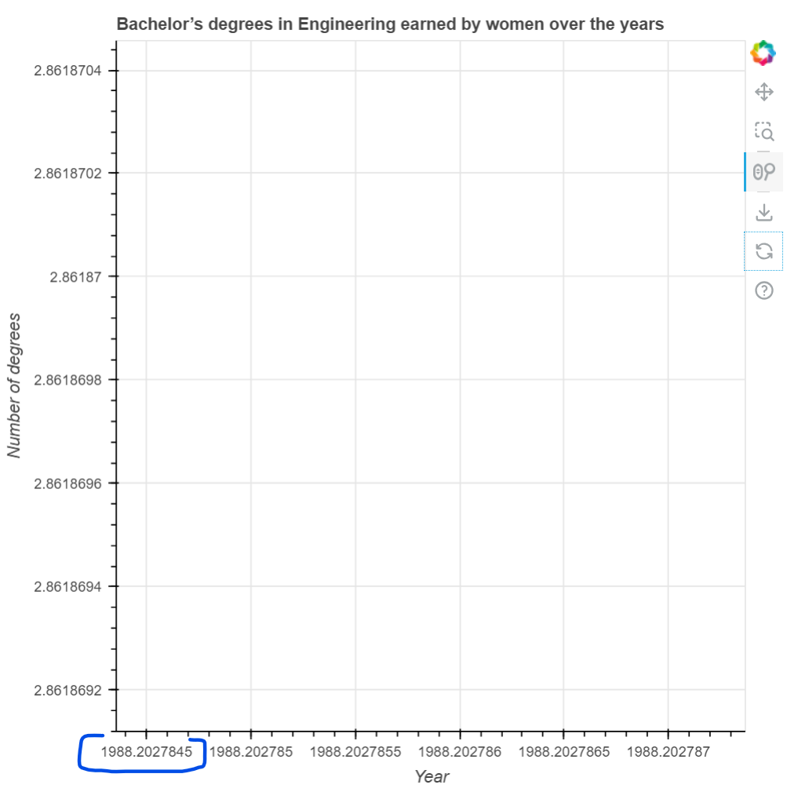
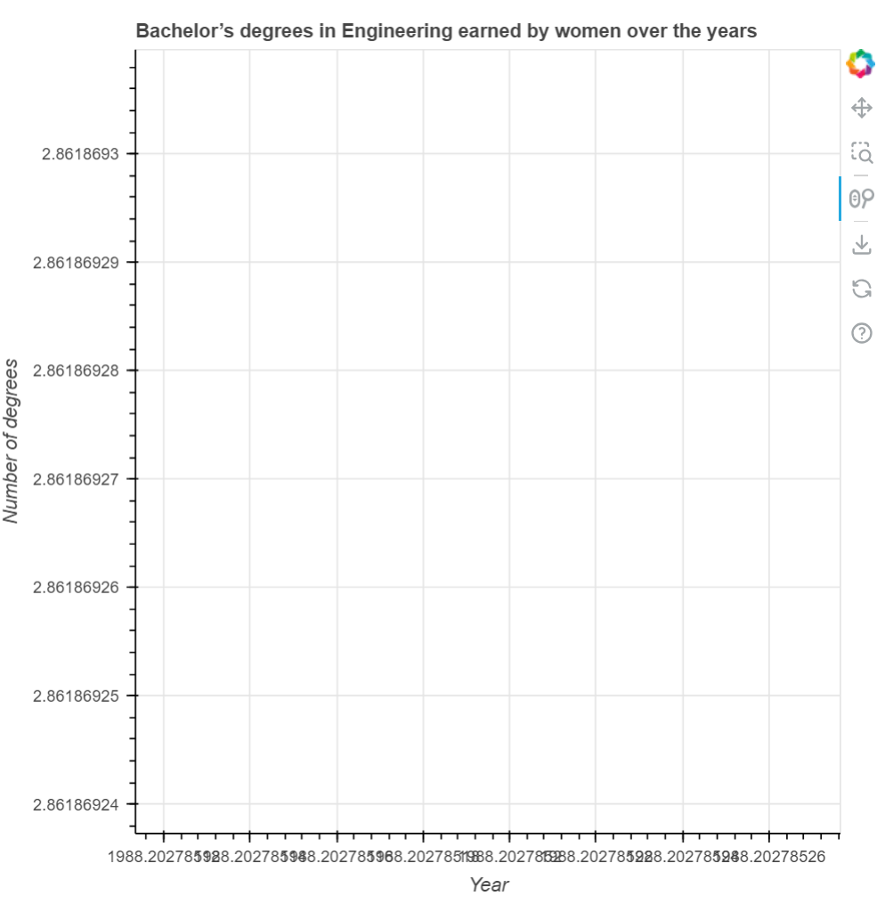

### Test Type Performed

Data in text is not human-readable.

### Artifact Evaluated

[Plotting interface](https://docs.bokeh.org/en/latest/docs/user_guide/basic.html#ug-basic). Specifically, evaluating the interfaces for all [charts](https://quansight-labs.github.io/bokeh-a11y-audit/#_ts1723552414769) in our test environment: line, bar, table and scatter plot.

### Results Summary

Plotting interface fails for human-readability. When using the zoom tool features, the axes labels can become nonunderstandble both visually and logically (eg: the axis measurement becoming Year: 1988.2027845).

### Expected Behavior (Pass/Fail)

- _FAIL_ - Data must be formatted to be human-readable. All textual information displayed (in data labels, annotations, axes, tables, legends, etc) must be formatted to an understandable level of content (ie “human readable”). These formats must also be made into versions that can be read and parsed comfortably by screen readers. (For example: 6500000000 should be formatted to 6.5b visually and to “six point five billion” when used in screen reader labels and alt text.)

### Image or Video of Failure

Figure 1

<figure>
    
    <figcaption>A line chart is shown. A 'Wheel Zoom' tool has been used to continually zoom in on the chart, which changes the axes data accordingly. In the bottom left corner, a blue box is highlighting an axis label that reads 'Year: 1988.2027845' (fails).</figcaption>
</figure>

Figure 2

<figure>
    
    <figcaption>A line chart is shown. A 'Wheel Zoom' tool has been used to continually zoom in on the chart, which changes the axes data accordingly. On the bottom of the chart, the axis labels have overlapped one another into one long text strand and become unreadable (fails).</figcaption>
</figure>

### Steps to Reproduce

Use a Zoom on the plot tool to interact with the chart. Continue to zoom in or out to see axes label changes.

### Guidelines and Standards Used

Data in text is not human-readable [https://chartability.github.io/POUR-CAF/#**dataintextisnothumanredable**](https://chartability.github.io/POUR-CAF/#__dataintextisnothumanreadable__)

<!-- ### Related Evidence
(Added if additional evidence has already been gathered for related elements. This will not be edited retroactively, however, due to scope creep. This means that the latest issues will have the most Related Evidence listed.) -->

<!-- ### Known or Documented Issues
(If there is already a github issue created for this test or a related test, it will be listed here.) -->

### Technical Details

- Chrome Version 129.0.6668.59 (64-bit)
- JAWS 2023.2402.1
- Windows 11 Build 22631.3958

_Updated as of: September 18th, 2024_

<!-- ### Notes
.. -->
