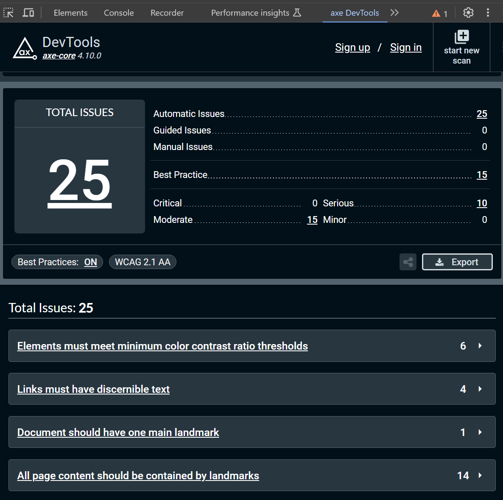
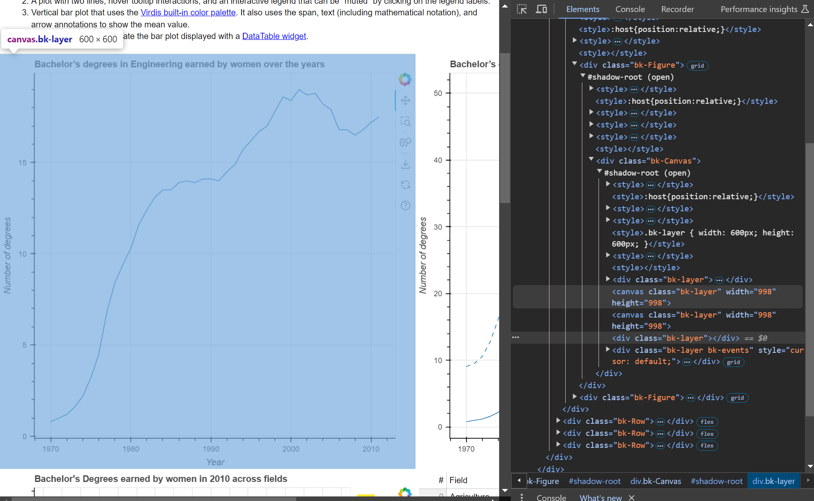

### Test Type Performed
Semantically valid.

### Artifact Evaluated
[Plotting interface](https://docs.bokeh.org/en/latest/docs/user_guide/basic.html#ug-basic). Specifically, evaluating the interfaces for all [charts](https://quansight-labs.github.io/bokeh-a11y-audit/#_ts1723552414769) in our test environment: line, bar, table and scatter plot.

### Results Summary
Plotting interface fails to be interactable and usable with multiple modalities. This issue also happens with the scatter plot's "All species" and "Selected species" tab widgets. Failures are most notable when using, navigating, and trying to interact with a screen reader. 

### Expected Behavior (Pass/Fail)
- *FAIL* - Semantically invalid use of document elements (if it functions like a button, but it is semantically other than a button, etc). Chart must be semantically valid according to modern standards. Initial testing (on the web) may be automated using any combination of: Axe-core, Wave, HTML Codesniffer, Accessibility Insights, or W3C Markup Validation but may only pass once a screen reader test has also verified the experience (see: Perceivable Failures for screen reader info).

The charts need to be given roles and put a system in place. Divs and canvas are meaningless for SRs. 

### Image or Video of Failure 
<figure>
    
    <figcaption>The element inspector pane of a web browser is opened. The axe DevTools tab is selected, with results on an assessment stating "Total Issues: 25".</figcaption>
</figure>

<figure>
    
    <figcaption>A line chart is shown with the element inspector pane of a web browser is opened. A section of code is highlighted that shows elements are divs and canvas.</figcaption>
</figure>

### Steps to Reproduce
1) Understand intented semantics.
1.a) are semantics funcitonal? (buttons, toggle buttons, etc.)
2) Is there an HTML elements or aria that can correctly portray that semantic intention?
2a) If yes, did they use that element?
2b) If not, is there something that could have been used?
3) If there is no valid possible semantics that they could rely on, did they construst semantics themselves?

### Guidelines and Standards Used
Semantically invalid [https://chartability.github.io/POUR-CAF/#__semanticallyinvalid__](https://chartability.github.io/POUR-CAF/#__semanticallyinvalid__)

### Related Evidence
See "Content is only visual (critical)," "Interaction modality has only one input type (critical)" and later tests we will perform based on using standard HTML.

### Known or Documented Issues
See "Plot tools: Semantically invalid" evidence.

### Technical Details
- Chrome Version 129.0.6668.59 (64-bit)
- JAWS 2023.2402.1 
- Windows 11 Build 22631.3958

*Updated as of: September 18th, 2024*
### Notes
As a note, if you test using WAVE or another equivalent tool, it won't won't be able to detect problems with divs and canvas elements because they are semanticless. Their assumed use is unknown.

Also note that *functional semantics* are less relevant for this test, since these are not interactive elements. But images should be `` or `<figure>` or (if interactive) something like `
`. No meaningful semantics are really used here. Passing this will require careful planning about *what* you intend and then matching that intention to the best semantic representations that exist.

<!-- A seasoned SR (screen reader) user could have the knowledge to navigate and explore webpages and graphs with more nuance, whether through manual mode switching, certain key shortcuts, etc. These tests are done by a sighted user with the SR’s default options and performed as if a new or beginner user is interacting with these elements. We would expect that all users could be able to navigate smoothly, regardless of experience levels. -->