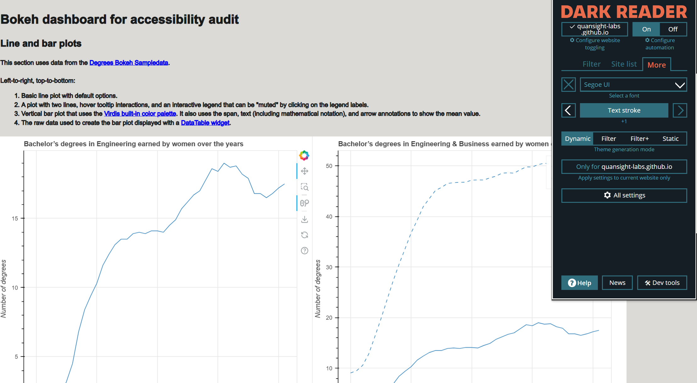

### Test Type Performed

User's text adjustments are respected.

### Artifact Evaluated

[Plotting interface](https://docs.bokeh.org/en/latest/docs/user_guide/basic.html#ug-basic). Specifically, evaluating the interfaces for all [charts](https://quansight-labs.github.io/bokeh-a11y-audit/#_ts1723552414769) in our test environment: line, bar, table and scatter plot.

### Results Summary

Plotting interface fails to allow users to adjust text, like text stroke, font, and/or font size.

### Expected Behavior (Pass/Fail)

- _FAIL_ - Text spacing and font-size changed by the user must be respected. Chart must not interfere with programmatic changes to font sizes or text spacing, such as importing a custom style sheet or using a browser’s build in zoom function. Font size and spacing must adjust accordingly.

### Image or Video of Failure

<figure>
    
    <figcaption>A line chart is shown. A text stroke filter has been implemented to +1. The text on the web page has adjusted to an increased text stroke, but the chart space retains it's default settings -- no adjustments have been made. (fails).</figcaption>
</figure>

### Steps to Reproduce

Using the Dark Reader extension, go to the "Text Stroke" setting and increase the slider.

### Guidelines and Standards Used

User's text adjustments are not respected [https://chartability.github.io/POUR-CAF/#**userstextadjustmentsarenotrespected**](https://chartability.github.io/POUR-CAF/#__userstextadjustmentsarenotrespected__)

### Related Evidence

See "User style change not respected (critical)" evidence.

<!-- ### Known or Documented Issues
(If there is already a github issue created for this test or a related test, it will be listed here.) -->

### Technical Details

- Chrome Version 129.0.6668.59 (64-bit)
- Windows 11 Build 22631.3958

_Updated as of: September 18th, 2024_

<!-- ### Notes
.. -->
