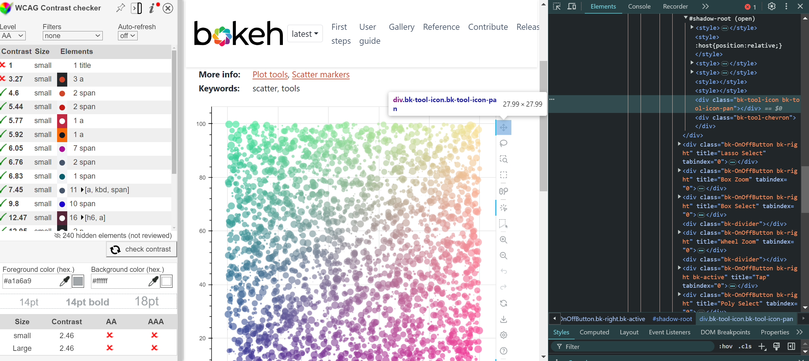

### Test Type Performed
Visual presents seizure risk.

### Artifact Evaluated
[Plot tools](https://docs.bokeh.org/en/latest/docs/user_guide/interaction/tools.html#ug-interaction-tools). Specifically, evaluating the interface icons that are used to access the tools that are in the [scatter plot](https://quansight-labs.github.io/bokeh-a11y-audit/#_ts1723552414769).

### Results Summary
Passes.

### Expected Behavior (Pass/Fail)
- *PASS* - Plot tools do not pose a seizure risk

### Image or Video of Failure 
<figure>
    
    <figcaption>A color scatter plot is shown. A plotting tool button is highlighted on the right, while the contrast checking score is shown on the bottom left corner (fails).</figcaption>
</figure>

### Steps to Reproduce
Record screen while using interactive features and elements and then run that through PEAT testing tool. In addition, check against common heuristics from WCAG (number of flashes present on the screen per second, etc).

### Guidelines and Standards Used
Visual presents seizure risk [https://chartability.github.io/POUR-CAF/#__visualpresentsseizurerisk___critical_](https://chartability.github.io/POUR-CAF/#__visualpresentsseizurerisk___critical_)

### Related Evidence
(Added if additional evidence has already been gathered for related elements. This will not be edited retroactively, however, due to scope creep. This means that the latest issues will have the most Related Evidence listed.)

### Known or Documented Issues
(If there is already a github issue created for this test or a related test, it will be listed here.)

### Technical Details
- Chrome Version 127.0.6533.89 (64-bit)
- Windows 11 Build 22631.3958

*Updated as of: August 2nd, 2024*

### Notes
<!-- A seasoned SR (screen reader) user could have the knowledge to navigate and explore webpages and graphs with more nuance, whether through manual mode switching, certain key shortcuts, etc. These tests are done by a sighted user with the SR’s default options and performed as if a new or beginner user is interacting with these elements. We would expect that all users could be able to navigate smoothly, regardless of experience levels.  -->
