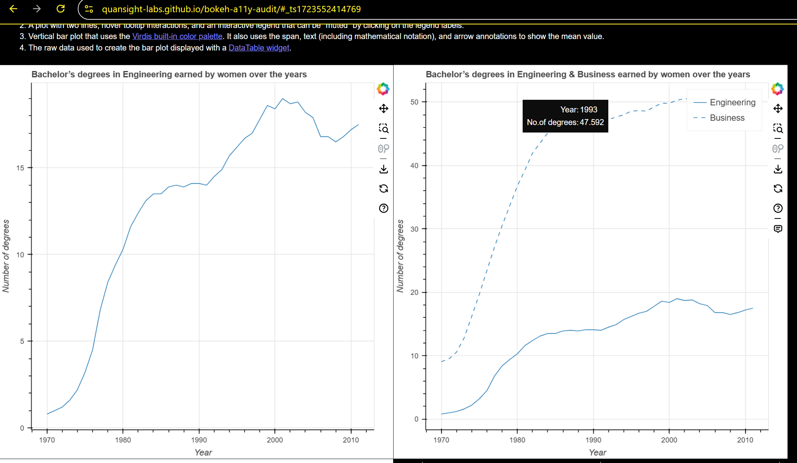

### Test Type Performed
Contrast and textures can be adjusted.

### Artifact Evaluated
[Annotations](https://docs.bokeh.org/en/latest/docs/user_guide/interaction.html): which include titles, axes labels, legends and their labels, colorbar, span (i.e, line), text, and arrows.

### Results Summary
Annotations fail to respect a user's custom changing of contrast and/or textures. (See "Notes" section.)

The hover tooltip, however, does respect user changes.

### Expected Behavior (Pass/Fail)
- *FAIL* - Contrast or textures must provide a way to be adjusted as-needed. Chart must not interfere with or override user’s independent contrast adjustments and chart must adjust accordingly to new settings. Chart textures (such as those used on fills) must be able to be turned on or off according to user preference.

### Image or Video of Failure 
<figure>
    
    <figcaption>A line chart is shown. A high contrast filter has been implemented, and the web browser background is black with yellow font. However, the chart space retains it's default color scheme - the contrast change was not applied (fails). Only the hover tooltip has respected the contrast change.</figcaption>
</figure>

### Steps to Reproduce
Using Windows contrast themes, choose Night Sky (high contrast) option and apply.

### Guidelines and Standards Used
Contrast and textures cannot be adjusted. [https://chartability.github.io/POUR-CAF/#__contrastandtexturescannotbeadjusted__](https://chartability.github.io/POUR-CAF/#__contrastandtexturescannotbeadjusted__)

### Related Evidence
See "User style change not respected (critical)" evidence.

### Known or Documented Issues
See "Plotting Interface: Contrast Textures Cannot Be Adjusted" form.

### Technical Details
- Chrome Version 130.0.6723.59 (64-bit)
- Windows 11 Build 22631.4317

*Updated as of: October 22nd, 2024*

<!-- ### Notes
These results can be viewed in the "Plotting Interface" results, as most of the annotations were tested there.  -->