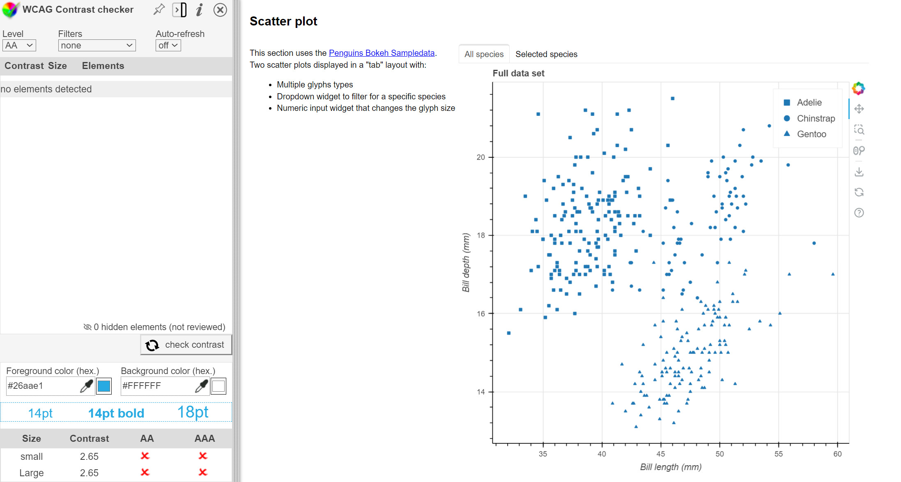

# Contrast Interactive Elements

## Test Type Performed

Low contrast on interactive elements.

## Artifact Evaluated

[Plot tools](https://docs.bokeh.org/en/latest/docs/user_guide/interaction/tools.html#ug-interaction-tools). Specifically, evaluating the interface icons that are used to access the tools that are in the [scatter plot](https://quansight-labs.github.io/bokeh-a11y-audit/#_ts1723552414769).

## Results Summary

Plot tools fail for minimum contrast on interactive elements. Results are 2.65:1, 1.42:1, and 1.86:1 (respectively to image evidence below.)

## Expected Behavior (Pass/Fail)

- _FAIL_ - We would expect interactive elements to pass a contrast ratio of 3:1 for the new state change against its previous state.

## Image or Video of Failure

<figure>
    
    <figcaption>A scatter plot is shown. A plotting tool button is toggled active on the right. The contrast checking score is shown on the bottom left corner (fails).</figcaption>
</figure>

<figure>
    
    <figcaption>A scatter plot is shown. A plotting tool button has a mouse hover highlight on the right, while the contrast checking score is shown on the bottom left corner (fails).</figcaption>
</figure>

<figure>
    
    <figcaption>A scatter plot is shown. A plotting tool button is selected, toggled "on", and has a mouse hover on the right highlight. The contrast checking score is shown on the bottom left corner (fails).</figcaption>
</figure>

## Steps to Reproduce

Using a dropper tool to gather the color, compare the foreground color against the background color to calculate the contrast score.

In this particular case, we tested the blue "selected" highlight of the icon against the full white background (1), the light-gray hover highlight against the full white background (2), and the blue "selected" highlight against the light-gray hover highlight (3). Avoiding aliased/partial pixels.

## Guidelines and Standards Used

Low contrast on interactive elements [https://chartability.github.io/POUR-CAF/#**lowcontrastoninteractiveelements**](https://chartability.github.io/POUR-CAF/#__lowcontrastoninteractiveelements__)

## Related Evidence

See "Low contrast (critical)" evidence.

## Known or Documented Issues

(If there is already a github issue created for this test or a related test, it will be listed here.)

## Technical Details

- Chrome Version 127.0.6533.89 (64-bit)
- WCAG Color Contrast checker extension
- Windows 11 Build 22631.3958

_Updated as of: August 2nd, 2024_

## Notes

<!-- A seasoned SR (screen reader) user could have the knowledge to navigate and explore webpages and graphs with more nuance, whether through manual mode switching, certain key shortcuts, etc. These tests are done by a sighted user with the SR’s default options and performed as if a new or beginner user is interacting with these elements. We would expect that all users could be able to navigate smoothly, regardless of experience levels.  -->
