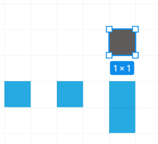
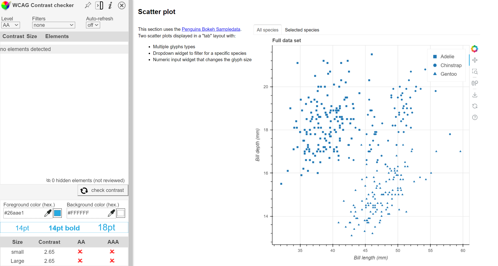
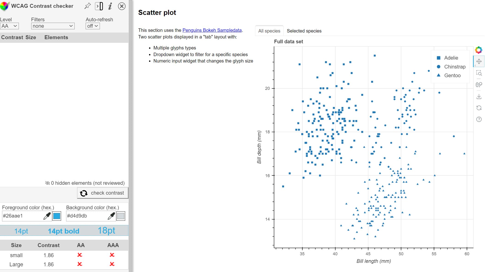

# Keyboard focus

## Test Type Performed

Keyboard focus indicator.

## Artifact Evaluated

[Plot tools](https://docs.bokeh.org/en/latest/docs/user_guide/interaction/tools.html#ug-interaction-tools). Specifically, evaluating the interface icons that are used to access the tools that are in the [scatter plot](https://quansight-labs.github.io/bokeh-a11y-audit/#_ts1723552414769).

## Results Summary

Plot tools fail for minimum contrast and border size for focus indicators. Results for contrast are 2.65:1 and 1.86:1 (respectively to image evidence below.) Result for focused border size is 1px.

## Expected Behavior (Pass/Fail)

- _FAIL_ - We would expect focus indicators to pass a minimum contrast ratio of 3:1 when focused or unfocused, and a border size of at least 2px.

## Image or Video of Failure

<figure>
    
    <figcaption>A screenshot of 4 blue squares are shown. Above the others is a black square that is highlighted, and says '1x1' pixel (fails).</figcaption>
</figure>
<figure>
    
    <figcaption>A scatter plot is shown. A plotting tool button is toggled active on the right. The contrast checking score is shown on the bottom left corner (fails).</figcaption>
</figure>
<figure>
    
    <figcaption>A scatter plot is shown. A plotting tool button is selected, toggled "on", and has a mouse hover on the right highlight. The contrast checking score is shown on the bottom left corner (fails).</figcaption>
</figure>

## Steps to Reproduce

For focus border size: Take a screenshot of the plot tool when the focused border is active, then paste into Figma. Using a rectangle figure too, create a 1x1 pixel box and compare to screenshot border.

For color contrast: Using a dropper tool to gather the color, compare the foreground color against the background color to calculate the contrast score.

In this particular case, we tested the blue "selected" highlight of the icon against the full white background (1) and the blue "selected" highlight against the light-gray hover highlight (3). Avoiding aliased/partial pixels.

## Guidelines and Standards Used

Keyboard focus indicator missing, obscured, or low contrast [https://chartability.github.io/POUR-CAF/#**keyboardfocusindicatormissingobscuredorlowcontrast**](https://chartability.github.io/POUR-CAF/#__keyboardfocusindicatormissingobscuredorlowcontrast__)

## Related Evidence

See "Low contrast interactive elements (critical)" and "Low contrast (critical)" evidence.

## Known or Documented Issues

(If there is already a github issue created for this test or a related test, it will be listed here.)

## Technical Details

- Chrome Version 127.0.6533.89 (64-bit)
- WCAG Color Contrast checker extension
- Windows 11 Build 22631.3958

_Updated as of: August 2nd, 2024_

## Notes

NOTE: As of right now, Chartability requires 4.5:1 but we're using the more-lenient WCAG 2.2 3:1 requirements instead (Chartability will use this in the future anyway).

<!-- A seasoned SR (screen reader) user could have the knowledge to navigate and explore webpages and graphs with more nuance, whether through manual mode switching, certain key shortcuts, etc. These tests are done by a sighted user with the SR’s default options and performed as if a new or beginner user is interacting with these elements. We would expect that all users could be able to navigate smoothly, regardless of experience levels.  -->
