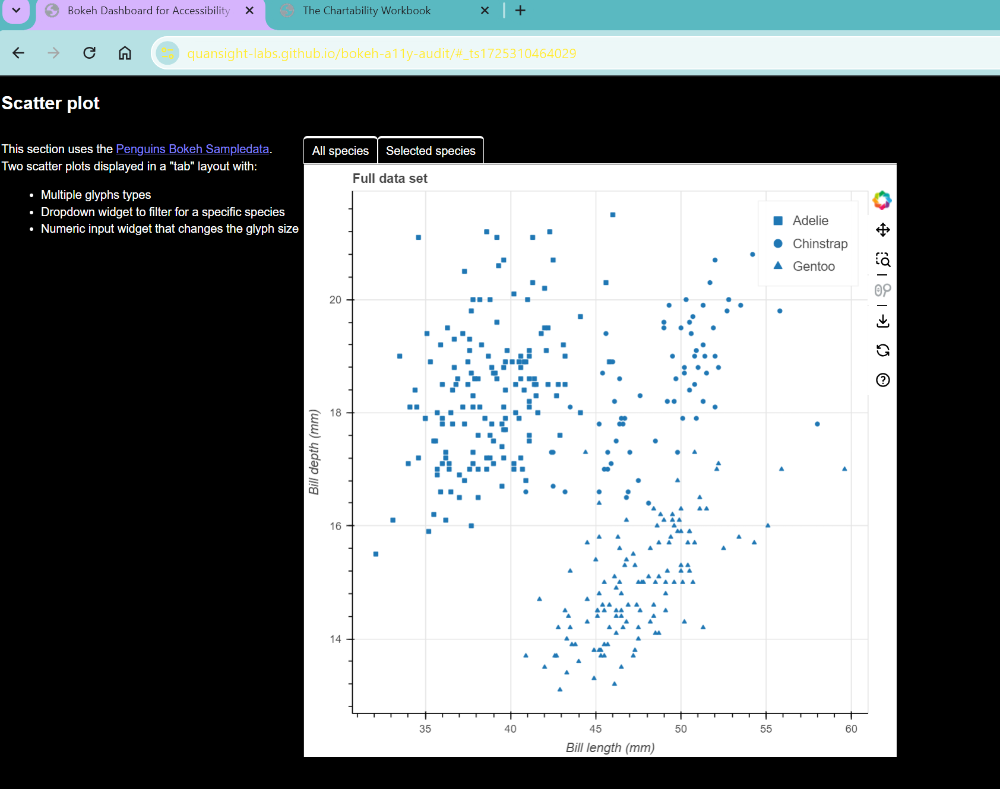

# Text Adjustments

## Test Type Performed
User's text adjustments are respected.

## Artifact Evaluated
[Plot tools](https://docs.bokeh.org/en/latest/docs/user_guide/interaction/tools.html#ug-interaction-tools). Specifically, evaluating the interface icons that are used to access the tools that are in the [scatter plot](https://quansight-labs.github.io/bokeh-a11y-audit/#_ts1723552414769).

## Results Summary
Test not applicable.
<!-- 
## Expected Behavior (Pass/Fail)
- *FAIL* - We expect that any styling changes a user makes (contrast, text strokes, etc) are not blocked from taking effect, and the charts do no override these styling changes.

## Image or Video of Failure 
<figure>
    
    <figcaption>A scatter plot is shown. A high contrast filter has been implemented, and the web browser background is black with yellow font. However, the chart space retains it's default color scheme - the contrast change was not applied (fails).</figcaption>
</figure>

## Steps to Reproduce
Using Windows contrast themes, choose Night Sky (high contrast) option and apply.

## Guidelines and Standards Used
User's text adjustments are not respected [https://chartability.github.io/POUR-CAF/#__userstextadjustmentsarenotrespected__](https://chartability.github.io/POUR-CAF/#__userstextadjustmentsarenotrespected__)

## Related Evidence
See "User style change not respected (critical)" evidence.

## Known or Documented Issues
(If there is already a github issue created for this test or a related test, it will be listed here.)

## Technical Details
- Chrome Version 128.0.6613.85 (64-bit)
- Windows high contrast theme
- Windows 11 Build 22631.3958

*Updated as of: September 2nd, 2024*

## Notes
Notes go here -->