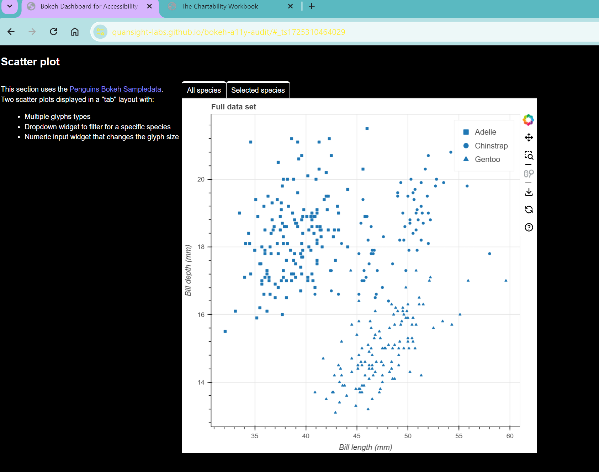

# Contrast Texture Adjustments

## Test Type Performed

Contrast and textures can be adjusted.

## Artifact Evaluated

[Plotting interface](https://docs.bokeh.org/en/latest/docs/user_guide/basic.html#ug-basic). Specifically, evaluating the interfaces for all [charts](https://quansight-labs.github.io/bokeh-a11y-audit/#_ts1723552414769) in our test environment: line, bar, table and scatter plot.

## Results Summary

Plotting interface fails to respect a user's custom changing of contrast and/or textures. The chart forms a "box" that retains it's default coloring.

## Expected Behavior (Pass/Fail)

- _FAIL_ - Contrast or textures must provide a way to be adjusted as-needed. Chart must not interfere with or override user’s independent contrast adjustments and chart must adjust accordingly to new settings. Chart textures (such as those used on fills) must be able to be turned on or off according to user preference.

## Image or Video of Failure

<figure>
    
    <figcaption>A scatter plot is shown. A high contrast filter has been implemented, and the web browser background is black with yellow font. However, the chart space retains it's default color scheme - the contrast change was not applied (fails).</figcaption>
</figure>

## Steps to Reproduce

Using Windows contrast themes, choose Night Sky (high contrast) option and apply.

## Guidelines and Standards Used

Contrast and textures cannot be adjusted. [https://chartability.github.io/POUR-CAF/#**contrastandtexturescannotbeadjusted**](https://chartability.github.io/POUR-CAF/#__contrastandtexturescannotbeadjusted__)

## Related Evidence

See "User style change not respected (critical)" evidence.

<!-- ## Known or Documented Issues
(If there is already a github issue created for this test or a related test, it will be listed here.) -->

## Technical Details

- Chrome Version 129.0.6668.59 (64-bit)
- Windows 11 Build 22631.3958

_Updated as of: September 18th, 2024_

<!-- ## Notes
Notes go here -->
