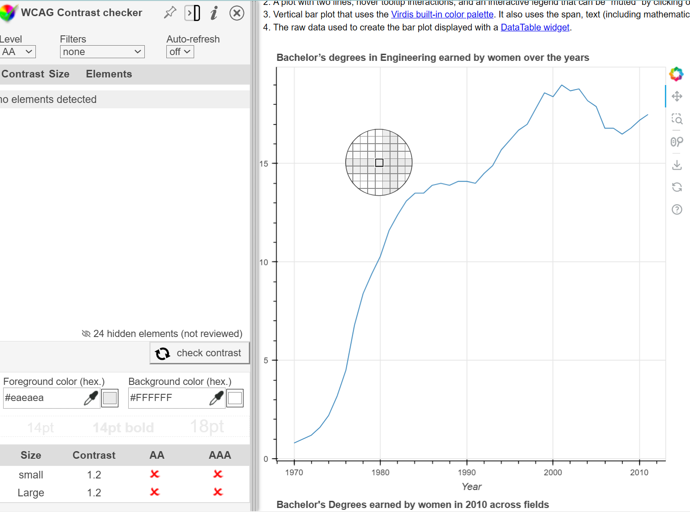
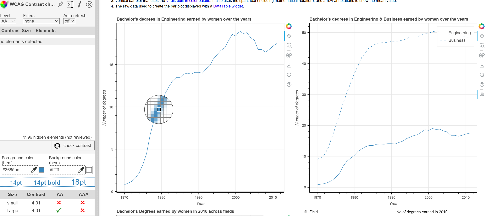
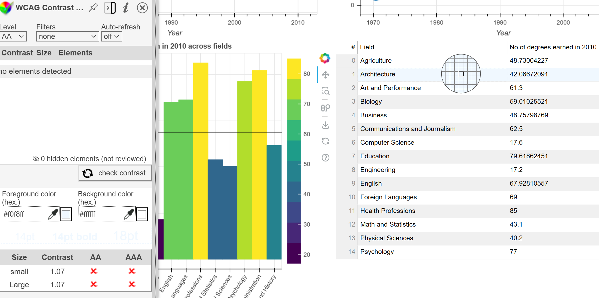
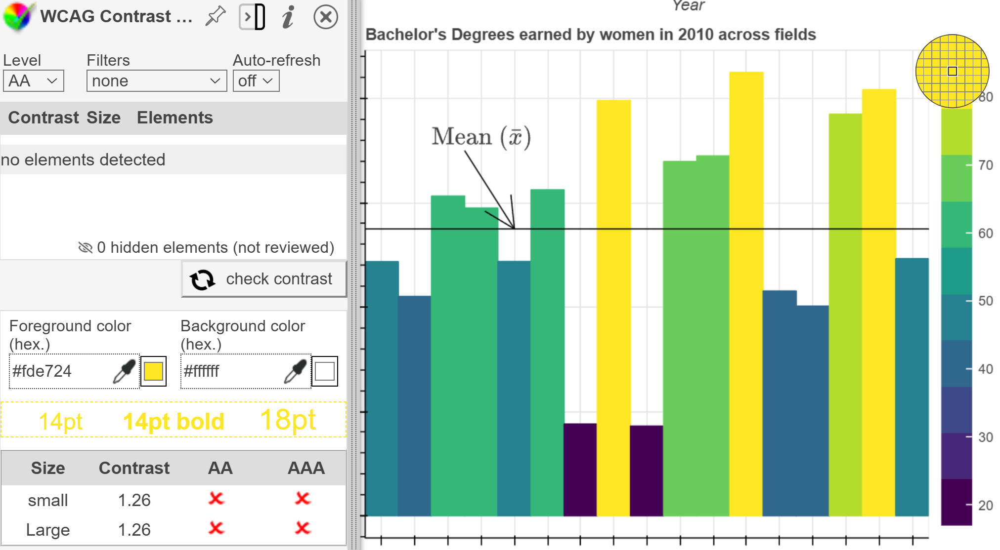
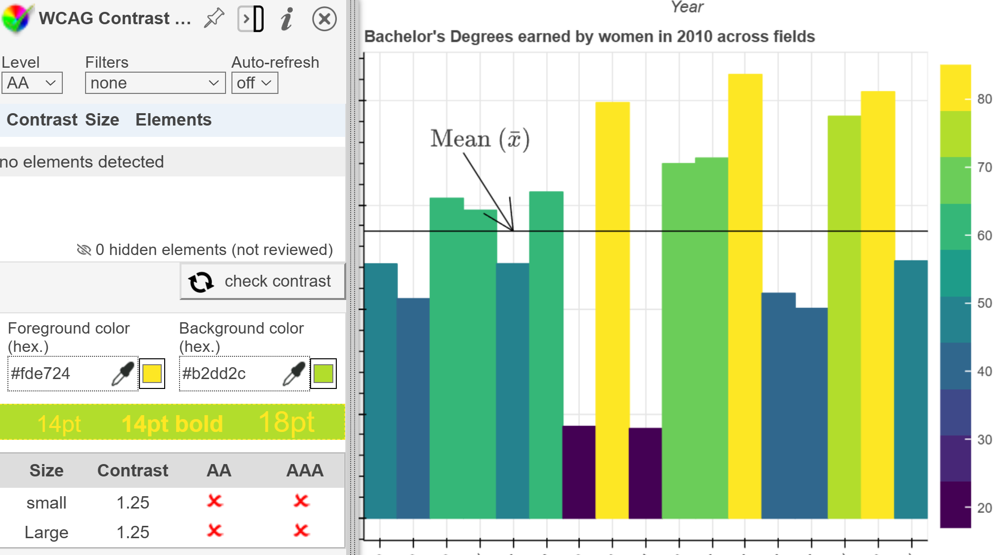

# Contrast

## Test Type Performed

Color Contrast.

## Artifact Evaluated

[Plotting interface](https://docs.bokeh.org/en/latest/docs/user_guide/basic.html#ug-basic). Specifically, evaluating the interfaces for all [charts](https://quansight-labs.github.io/bokeh-a11y-audit/#_ts1723552414769) in our test environment: line, bar, table and scatter plot.

## Results Summary

Plotting interface has failures for minimum contrast.
Text: The table's numbered column fails at 1.6. All other text passes.

Axes: Grid lines fail at 1.17. Main axes pass.

Line charts: Fail at 2.87.

Table: Fails contrast for selection highlight at 1.07.

Bar chart: The first 5/10 colors fail contrast against a white backdrop (starting at the top and working down). Fails are as follows: 1.26, 1.58, 2, 2.56, and 3.4.

All colors fail for ordered pairs. See both "Problems.." sections below.

Scatter plot: Passes.

### Problems unique to lines

Lines are hard to perceive already because they are often thin. And we don't include element size in our contrast calculations, so it is very important to still hit minimum contrast colors for lines used. For plotted marks, like lines in a line chart, follow this strictly. For grid or axis lines, you can consider alternative ways to lower contrast that still technically pass contrast scores, such as making them dotted lines.

### Problems unique to adjacent, ordered colors

In situations where colors are ordered and adjacent, they need to pass "pair contrast" as well as contrast against their background. The legend in the bar chart is a good example of this. This is a sequential scheme where each step will fail contrast against sibling steps. (See examples [here](https://observablehq.com/@frankelavsky/contrast-and-no-use-of-color-alone-in-adjacent-charts).)

Consider either removing the pixel between these categories, so that each color only needs to pass against the background, or consider having much fewer color steps with much larger steps in contrast (although this significantly limits the scheme's options overall).

### Problems unique to adjacent, unordered colors

So in the bar chart as well as the scatter plot, colors of elements overlap and intersect with one another and fail contrast. Consider adding 1 pixel of white between everything, especially if it is important to be able to discern individual elements from one another. (See examples [here](https://observablehq.com/@frankelavsky/experimental-color-scale-textures).)

The bar should do this. But sometimes scatterplots are meant to be perceived "as a whole" - so it is less important for every individual element to be distinguishable from one another visually. All elements should still pass contrast against their background, however.

### Problems unique to tables

Although it does fail, the table's contrast of row color alternation does not seem meaningful enough to count for testing. Something that could help create a stronger, more meaningful contrast could be adding the ability to have a highlight hover and not only click-selection highlights.

## Expected Behavior (Pass/Fail)

- _FAIL_ - We would expect interface elements to pass a contrast ratio of either 4.5:1 for text or 3:1 for graphics.

## Image or Video of Failure

Figure 1: Grid lines

<figure>
    
    <figcaption>A line chart is shown. A color selection dropper is highlighting a gride line within the chart. The contrast checking score of 1.2 is shown on the bottom left corner (fails).</figcaption>
</figure>

Figure 2: Line charts

<figure>
    
    <figcaption>A line chart is shown. A color selection dropper is highlighting a data line within the chart. The contrast checking score of 4.01 is shown on the bottom left corner (fails).</figcaption>
</figure>

Figure 3: Table

<figure>
    
    <figcaption>A table is shown. A color selection dropper is highlighting a selected row in the chart. The contrast checking score of 1.07 is shown on the bottom left corner (fails).</figcaption>
</figure>

Figure 4 and 5: Bar Chart

<figure>
    
    <figcaption>A color bar chart is shown. A color selection dropper is highlighting the first bar color on the legend. The contrast checking score of 1.26 is shown on the bottom left corner (fails).</figcaption>
</figure>

<figure>
    
    <figcaption>A color bar chart is shown. The contrast checking score of 1.25 is shown on the bottom left, comparing two colors right next to one another (fails).</figcaption>
</figure>

## Steps to Reproduce

Using a dropper tool to gather the color, compare the foreground color against the background color to calculate the contrast score. For the bar chart, also test ordered colors against one another.

For each respective chart, we tested the full interior pixels of interface elements (lines, bars, plots, table) against the full white background (avoiding aliased/partial pixels).

## Guidelines and Standards Used

Low contrast minimums [https://chartability.github.io/POUR-CAF/#**lowcontrast\_**critical\_](https://chartability.github.io/POUR-CAF/#__lowcontrast___critical_)

## Related Evidence

...

## Known or Documented Issues

See "Plot tools" contrast evidence.

## Technical Details

- Chrome Version 128.0.6613.120 (64-bit)
- WCAG Color Contrast checker extension
- Windows 11 Build 22631.3958

_Updated as of: September 10th, 2024_

<!-- ## Notes
A seasoned SR (screen reader) user could have the knowledge to navigate and explore webpages and graphs with more nuance, whether through manual mode switching, certain key shortcuts, etc. These tests are done by a sighted user with the SR’s default options and performed as if a new or beginner user is interacting with these elements. We would expect that all users could be able to navigate smoothly, regardless of experience levels.  -->
