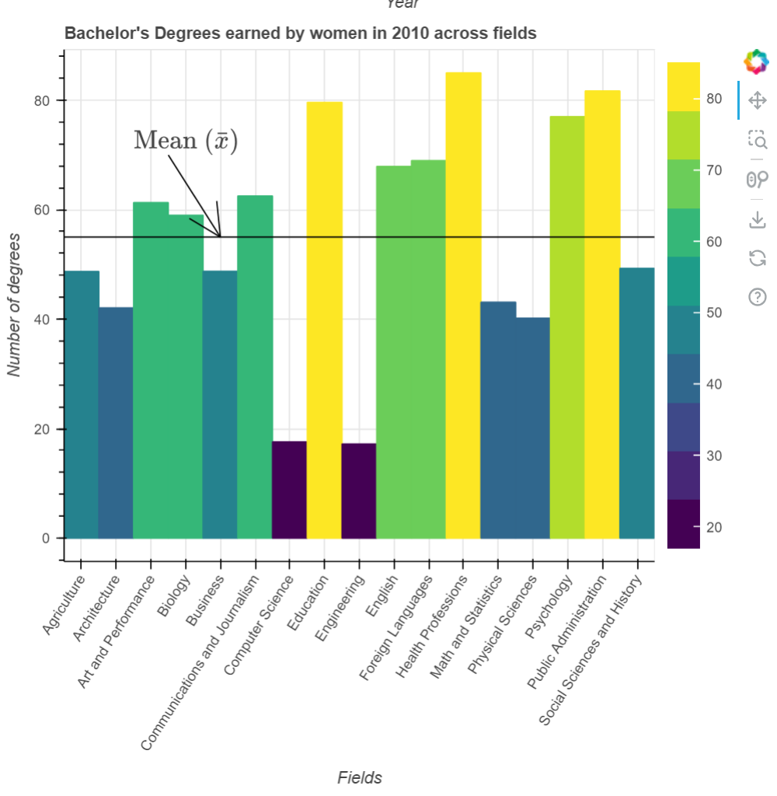

# Explanation Purpose

## Test Type Performed

Explanation for purpose or for how to read.

## Artifact Evaluated

[Plotting interface](https://docs.bokeh.org/en/latest/docs/user_guide/basic.html#ug-basic). Specifically, evaluating the interfaces for all [charts](https://quansight-labs.github.io/bokeh-a11y-audit/#_ts1723552414769) in our test environment: line, bar, table and scatter plot.

## Results Summary

Plotting interface fails to provide explanations for any of the charts.

## Expected Behavior (Pass/Fail)

- _FAIL_ - Chart should explain its purpose and how to read, use, and interpret it.

## Image or Video of Failure

<figure>
    
    <figcaption>A screenshot of a bar chart is shown. While there is a tile and axes titles, there is no explanation for the chart or it's purpose with it.</figcaption>
</figure>

<!-- ## Steps to Reproduce
Navigate to the "Scatterplot" chart heading. -->

## Guidelines and Standards Used

No explanation for purpose or for how to read [https://chartability.github.io/POUR-CAF/#**noexplanationforpurposeorforhowtoread\_**critical\_](https://chartability.github.io/POUR-CAF/#__noexplanationforpurposeorforhowtoread___critical_)

## Related Evidence

See "Content is visual only (critical)" evidence.

Note that "No explanation for purpose or how to read" may appear identical at first to "interactive context is not clear" as well as "No interaction instructions" since these are all in relation to interactive elements.

<!-- ## Known or Documented Issues
(If there is already a github issue created for this test or a related test, it will be listed here.) -->

## Technical Details

- Chrome Version 129.0.6668.59 (64-bit)
- Windows 11 Build 22631.3958

_Updated as of: September 18th, 2024_

## Notes

This could conditionally pass depending on how you view it. I'm not sure if the plotting interface is responsible for also providing explanations for each chart's purpose and how to read, use, and interpret it. Users do need this, and I'm not sure where in our testing this will apply so I want to reiterate it here.
