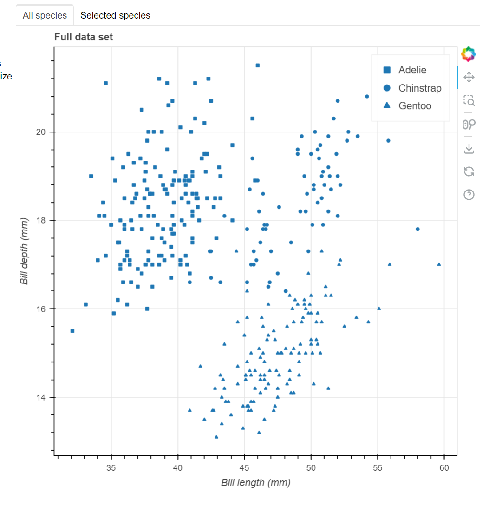
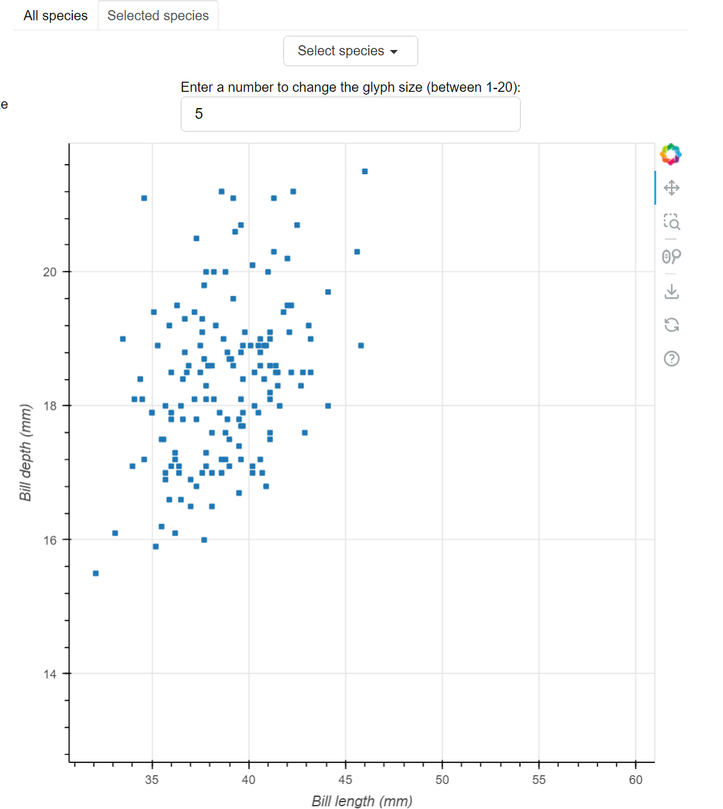
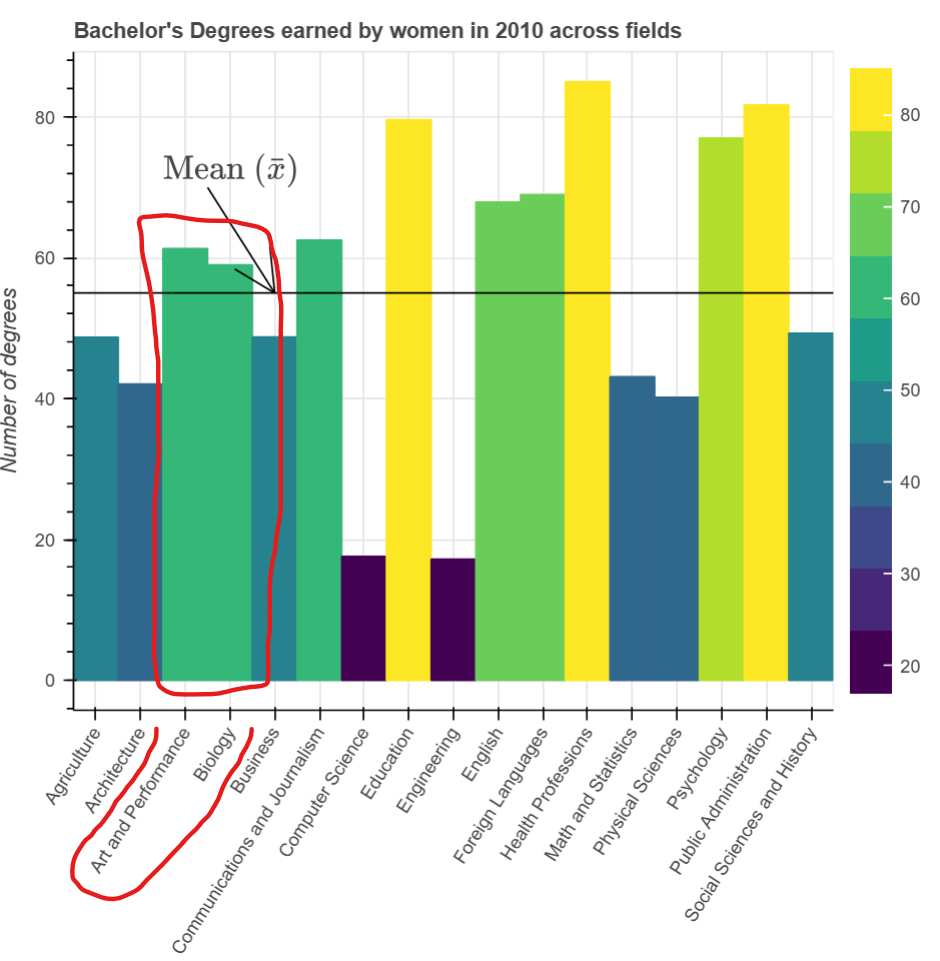

# Information Complexity

## Test Type Performed

Information complexity is appropriate.

## Artifact Evaluated

[Plotting interface](https://docs.bokeh.org/en/latest/docs/user_guide/basic.html#ug-basic). Specifically, evaluating the interfaces for all [charts](https://quansight-labs.github.io/bokeh-a11y-audit/#_ts1723552414769) in our test environment: line, bar, table and scatter plot.

## Results Summary

Plotting interface fails for the scatter plot and bar chart.

Scatter plot: While the chart's sub-view passes (figure 2), the default view could fail because the encoded categories are hard to tell apart (figure 1). This creates more complexity.

Bar chart: The lack of spacing for the bars in the chart create complexity.

## Expected Behavior (Pass/Fail)

- _FAIL_ - Information complexity must be appropriate to the task or goal of the visual. Often, this is an issue when charts have too many different kinds of information encoded (note that this isn't the same as density). Chart must not have more than one Y or X axis without first presenting two charts separately. Chart must not encode along a third spatial dimension (z axis) unless the data itself is 3D (spatial, modeling, etc). Chart should not contain more than 5 data categories.

## Image or Video of Failure

Figure 1

<figure>
    
    <figcaption>A scatter plot is shown. Three categories are shown, but are hard to differentiate from one another based on their color and patterns.</figcaption>
</figure>

Figure 2

<figure>
    
    <figcaption>A scatter plot is shown. In the chart's upper tab, 'Selected Species' is selected. One category of data is shown and is signified by a blue square pattern.</figcaption>
</figure>

Figure 3

<figure>
    
    <figcaption>A bar chart is shown. A red box is highlighting two bars that are side-by-side and the same color. There is no spacing be tween the two, making it almost appear as one large bar (this is both a perceptual issue due to lack of differentiation as well as an information complexity issue for making it hard to meaningfully create visual categorization). Also, this chart is encoding color and height redundantly for the value of a category, which is may cause confusion for being an unconventional dual encoding.</figcaption>
</figure>

## Steps to Reproduce

For Scatter:
Using the scatter plot's tab setting, first view the chart in default view. Next, go to the "Selected Species" tab and choose a drop-down option.

Examine all charts:

- Check that each important piece of information can be easily and accurately discerned from one another
- check that groupings, categories, trends, and patterns can be discerned and interpreted easily
- Check whether any complexity can be reduced without loss of accessibility or understanding (think of this as "complexity-to-ink ratio" in a similar way as Tufte's data-to-ink ratio)

## Guidelines and Standards Used

Information complexity is inappropriate [https://chartability.github.io/POUR-CAF/#**informationcomplexityisinappropriate**](https://chartability.github.io/POUR-CAF/#__informationcomplexityisinappropriate__)

## Related Evidence

See "Spacing is inapproriate" evidence.

<!-- ## Known or Documented Issues
(If there is already a github issue created for this test or a related test, it will be listed here.) -->

## Technical Details

- Chrome Version 129.0.6668.59 (64-bit)
- Hemingway Editor browser app
- Windows 11 Build 22631.3958

_Updated as of: September 18th, 2024_

<!-- ## Notes
A seasoned SR (screen reader) user could have the knowledge to navigate and explore webpages and graphs with more nuance, whether through manual mode switching, certain key shortcuts, etc. These tests are done by a sighted user with the SR’s default options and performed as if a new or beginner user is interacting with these elements. We would expect that all users could be able to navigate smoothly, regardless of experience levels.  -->
