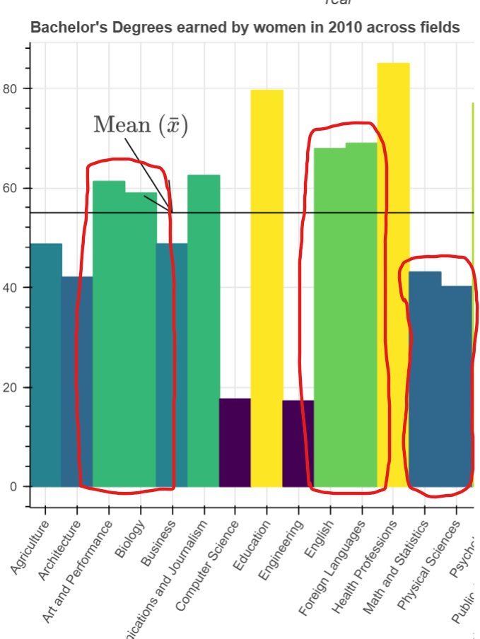
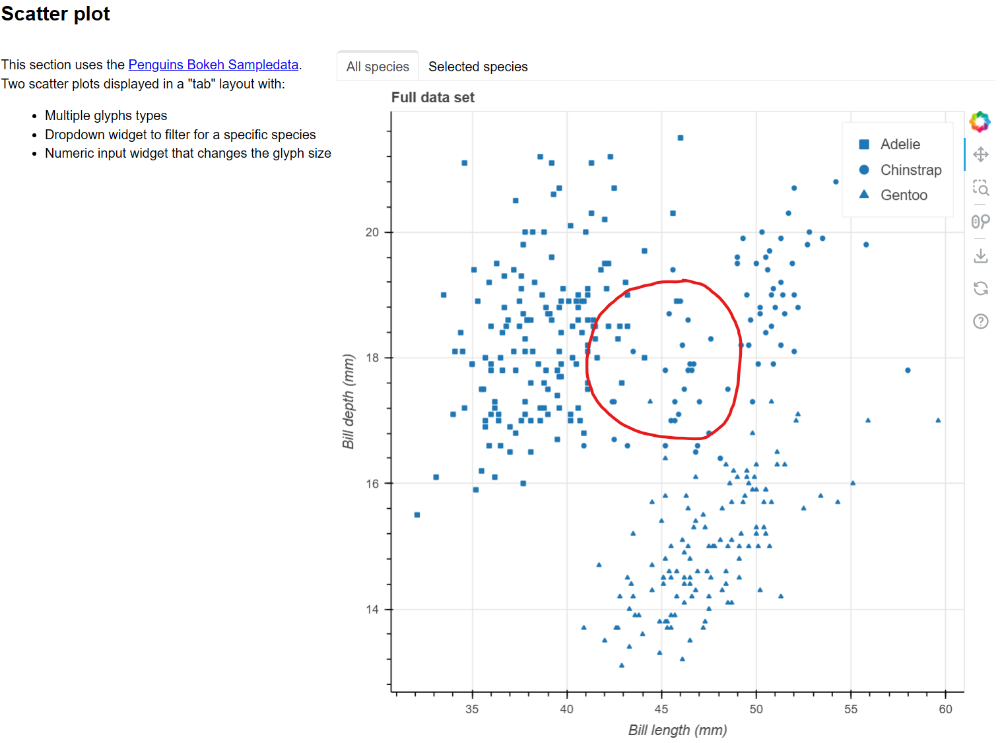

# Meaningful Elements

## Test Type Performed

Meaningful elements can be distinguished from each other.

## Artifact Evaluated

[Plotting interface](https://docs.bokeh.org/en/latest/docs/user_guide/basic.html#ug-basic). Specifically, evaluating the interfaces for all [charts](https://quansight-labs.github.io/bokeh-a11y-audit/#_ts1723552414769) in our test environment: line, bar, table and scatter plot.

## Results Summary

Plotting interface fails for the bar chart and for the scatter plot. The bar chart elements have no spacing or border.

The scatter plot may conditionally pass or fail, depending on the intent. From it's default view, the three categories show clusters - which might be the important meaning. But while the data points are different patterns for each category, the color and size makes it difficult to discern them from one another. (See "Notes" section below.)

## Expected Behavior (Pass/Fail)

- _FAIL_ - Adjacent elements must have at least 1px white space between them (like stacked bars or pie charts where elements “touch”). Text (any) must not be obscured or overlapped by any other elements.

## Image or Video of Failure

Figure 1: Bar chart

<figure>
    
    <figcaption>A bar chart is shown. A red box is highlighting two bars that are side-by-side and the same color. There is no spacing be tween the two, making it almost appear as one large bar (fails).</figcaption>
</figure>

Figure 2: Scatter plot

<figure>
    
    <figcaption>A scatter plot is shown. A red circle is highlighting an area with three data sets differentiated by squares, circles, and triangles. From this view, it is hard to tell the patterns apart - they all look similar (fails).</figcaption>
</figure>

## Steps to Reproduce

- Determine which elements are meaningful
- Test whether these elements can be distinguished from other meaningful elements (typically at least whether they have at least 1px separation)
- NOTE: Since shape is harder to distinguish from one another than color, it actually would be helpful to add color to the scatterplot in addition to shape-based encoding.

## Guidelines and Standards Used

Meaningful elements can be distinguished from each other
[https://chartability.github.io/POUR-CAF/#**meaningfulelementscanbedistinguishedfromeachother**](https://chartability.github.io/POUR-CAF/#__meaningfulelementscanbedistinguishedfromeachother__)

## Related Evidence

See "Low contrast" and "Information Complexity."

## Known or Documented Issues

...

## Technical Details

- Chrome Version 128.0.6613.120 (64-bit)
- Windows 11 Build 22631.3958

_Updated as of: September 10th, 2024_

## Notes

We lean towards a failing if anything is questionable. For the scatter plot - there is no standard qualitative or quantitative test for whether shapes can easily be distinguished from one another.

Since we don't have a standard, testing for shape-distinguishability isn't written in as something we explicitly test for in Chartability. However, we're failing primarily based on how this scatterplot feels, which is that it feels hard to differentiate these shapes apart.

Scatterplots are tricky because sometimes you actually _want_ the scatterplot elements to sort of "construct" a whole picture in aggregate, that is to say that plotting elements together, with overlap, is actually _intended_ as a proxy for density. So sometimes scatterplots ca get a soft pass (or fail) for this reason. But in this case, there are 3 separate categories shown in the default view and they are pretty hard to tell apart. A posteriori someone could tell them apart (after using the dropdown to subselect), but this means that the initial view isn't too useful and could likely cause confusion or even be misleading as a default pattern.
