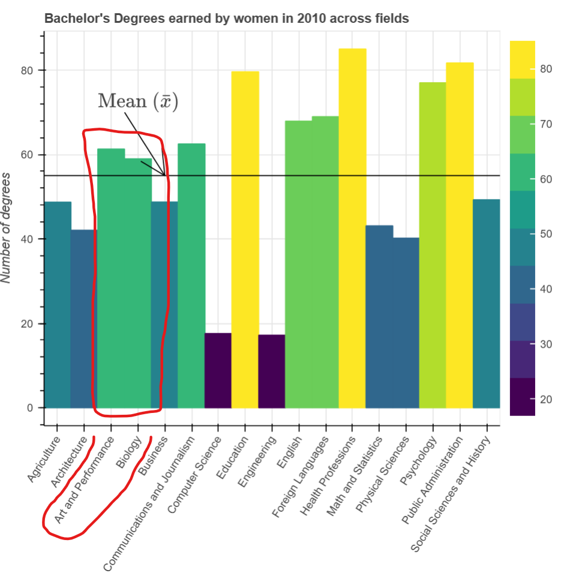

# Spacing

## Test Type Performed

Spacing is appropriate.

## Artifact Evaluated

[Plotting interface](https://docs.bokeh.org/en/latest/docs/user_guide/basic.html#ug-basic). Specifically, evaluating the interfaces for all [charts](https://quansight-labs.github.io/bokeh-a11y-audit/#_ts1723552414769) in our test environment: line, bar, table and scatter plot.

## Results Summary

The bar chart fails for spacing.

## Expected Behavior (Pass/Fail)

- _FAIL_ - At least 1 pixel visual and interactive gap should be provided between interactive elements that are categorically different. For clustering and encodings where non-interactive elements overlap, this test is not relevant.

- Use of white space and other forms of padded, structured spacing should be appropriate. Too much or too little white space on charts with intervals (like a bar chart with thin bars and large gaps or vice a versa) can cause perceivable and understandable issues.

## Image or Video of Failure

<figure>
    
    <figcaption>A bar chart is shown. A red box is highlighting two bars that are side-by-side and the same color. There is no spacing be tween the two, making it almost appear as one large bar (fails).</figcaption>
</figure>

## Steps to Reproduce

Measure gap size and element size for repeating, aligned elements. Gaps should not be wider than 50% of element size in cases where elements are laid out in a regular pattern or fashion.

## Guidelines and Standards Used

Spacing is inappropriate [https://chartability.github.io/POUR-CAF/#**spacingisinappropriate**](https://chartability.github.io/POUR-CAF/#__spacingisinappropriate__)

## Related Evidence

See "Meaningful elements can be distinguished from each other" evidence about borders.

## Known or Documented Issues

...

## Technical Details

- Chrome Version 128.0.6613.120 (64-bit)
- Windows 11 Build 22631.3958

_Updated as of: September 10th, 2024_

<!-- ## Notes
A seasoned SR (screen reader) user could have the knowledge to navigate and explore webpages and graphs with more nuance, whether through manual mode switching, certain key shortcuts, etc. These tests are done by a sighted user with the SR’s default options and performed as if a new or beginner user is interacting with these elements. We would expect that all users could be able to navigate smoothly, regardless of experience levels.  -->
