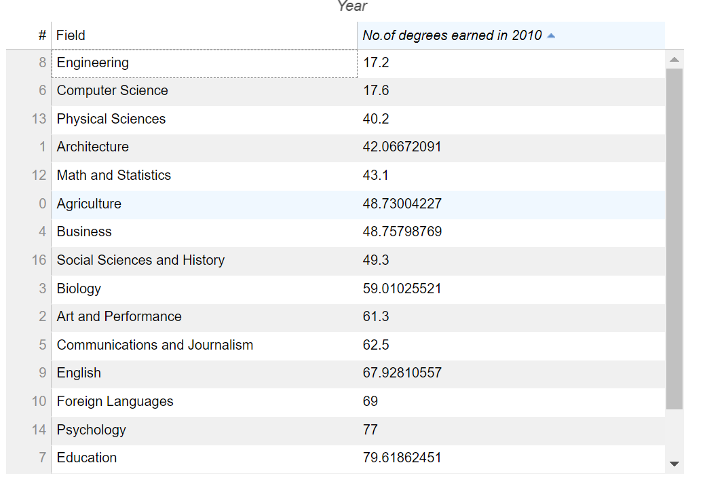

# Static Table

## Test Type Performed

Table/data is static.

## Artifact Evaluated

[Plotting interface](https://docs.bokeh.org/en/latest/docs/user_guide/basic.html#ug-basic). Specifically, evaluating the interfaces for all [charts](https://quansight-labs.github.io/bokeh-a11y-audit/#_ts1723552414769) in our test environment: line, bar, table and scatter plot.

## Results Summary

Plotting interface provides filtering and sorting for table data.

## Expected Behavior (Pass/Fail)

- _Pass_ - Provided table must at least be downloadable, filterable, or sortable.

## Image or Video of Failure

<figure>
    
    <figcaption>A data table is shown. A sorting table is selected and highlighted in blue, sorting the data by 'Number of degrees earned in 2010'.</figcaption>
</figure>

<!-- ## Steps to Reproduce
Use Inspect on the plot tool icon to open Console Command. Find the "style" section for the selected button then locate the font size. -->

## Guidelines and Standards Used

Table/data is statis [https://chartability.github.io/POUR-CAF/#**tabledataisstatic**](https://chartability.github.io/POUR-CAF/#__tabledataisstatic__)

<!-- ## Related Evidence
(Added if additional evidence has already been gathered for related elements. This will not be edited retroactively, however, due to scope creep. This means that the latest issues will have the most Related Evidence listed.) -->

<!-- ## Known or Documented Issues
(If there is already a github issue created for this test or a related test, it will be listed here.) -->

## Technical Details

- Chrome Version 129.0.6668.59 (64-bit)
- JAWS 2023.2402.1
- Windows 11 Build 22631.3958

_Updated as of: September 18th, 2024_

<!-- ## Notes
A seasoned SR (screen reader) user could have the knowledge to navigate and explore webpages and graphs with more nuance, whether through manual mode switching, certain key shortcuts, etc. These tests are done by a sighted user with the SR’s default options and performed as if a new or beginner user is interacting with these elements. We would expect that all users could be able to navigate smoothly, regardless of experience levels.  -->
